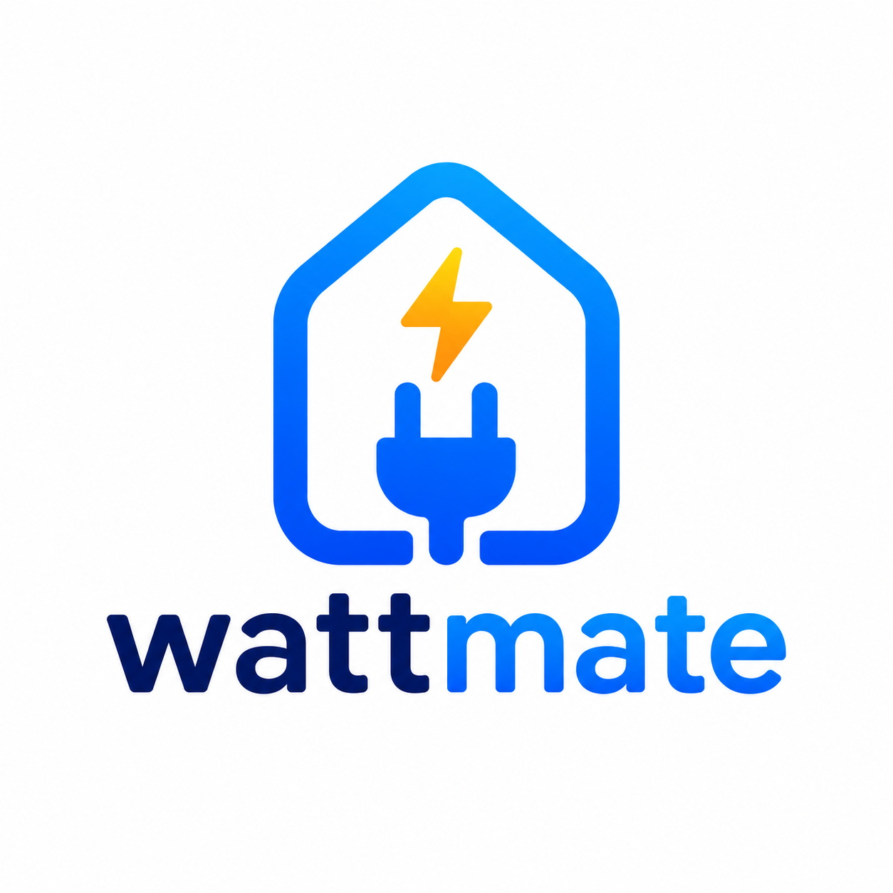

# ⚡ WattMate - Smart Electricity Management System

<div align="center">
  
  
  ### Aplikasi Manajemen Token Listrik Pintar untuk Kos-kosan
  
  [](https://flutter.dev)
  [](https://dart.dev)
  [](LICENSE)
</div>

---

## 📖 Tentang Aplikasi

**WattMate** adalah aplikasi manajemen listrik berbasis mobile untuk pengelola kos-kosan yang memungkinkan pemantauan real-time penggunaan daya, manajemen transaksi token, dan komunikasi dengan penyewa melalui satu platform terpadu.

### 🎯 Tujuan

- Memudahkan monitoring penggunaan listrik di setiap kamar
- Otomasi reminder untuk token yang hampir habis
- Pencatatan transaksi token yang tertib
- Statistik penggunaan untuk analisis konsumsi energi

---

## ✨ Fitur Utama

### 🏠 **Dashboard**

- Overview statistik kamar (total, terisi, kosong)
- Total transaksi bulanan
- Grafik penggunaan real-time kWh
- Power gauge monitoring
- Peringatan kamar kritis
- Refresh manual untuk update data

### 🚪 **Manajemen Kamar**

- Daftar lengkap kamar dengan status (Aktif, Warning, Kritis, Kosong)
- Filter berdasarkan status kamar
- Detail informasi penghuni dan meteran
- Statistik penggunaan 7 hari (bar chart)
- Edit informasi penghuni (nama, telepon)
- Fitur checkout penghuni dengan konfirmasi dialog
- Tambah penghuni baru untuk kamar kosong

### 💰 **Transaksi**

- Riwayat semua transaksi token
- Filter berdasarkan status (Berhasil, Pending, Gagal)
- Detail transaksi dengan kode token
- Format mata uang Rupiah
- Timestamp lengkap

### 💬 **WhatsApp Bot**

- Template pesan otomatis
- Kategori pesan (Reminder, Peringatan, Promosi, Info)
- Kirim pesan langsung ke penghuni
- Broadcast ke semua penghuni

### 📊 **Laporan**

- Laporan bulanan lengkap
- Grafik tren transaksi 6 bulan
- Statistik kamar
- Export laporan (coming soon)

### 👤 **Profil & Pengaturan**

- Profil admin dengan statistik
- Edit profil (nama, email, telepon)
- Ubah password dengan validasi kuat
- Pengaturan notifikasi (App, Email, WhatsApp)
- Tema aplikasi
- Pengaturan keamanan (2FA, Biometrik)
- Pusat bantuan dan FAQ

---

## 🛠️ Tech Stack

- **Framework**: Flutter 3.12.2
- **Language**: Dart 3.0+
- **UI Components**: Material Design 3
- **Fonts**: Google Fonts (Poppins)
- **State Management**: StatefulWidget + setState
- **Navigation**: Bottom Navigation Bar (Animated)
- **Charts**: Custom Canvas Painters
- **Internationalization**: intl package
- **Platform**: Android, iOS, Web

---

## 📱 Screenshots

### Main Screens

```
🏠 Dashboard    │  🚪 Rooms    │  💰 Transactions  │  💬 WhatsApp  │  📊 Reports
```

### Key Features

```
📝 Edit Profile  │  🔐 Change Password  │  ⚙️ Settings  │  ℹ️ Help Center
```

---

## 🚀 Instalasi & Setup

### Prerequisites

- Flutter SDK 3.12.2 atau lebih tinggi
- Dart 3.0+
- Android Studio / VS Code dengan Flutter extensions
- Emulator atau device untuk testing

### Langkah-langkah Instalasi

1. **Clone repository**

   ```bash
   git clone https://github.com/brillianjs/wattmate.git
   cd wattmate
   ```

2. **Install dependencies**

   ```bash
   flutter pub get
   ```

3. **Run aplikasi**

   ```bash
   # Web
   flutter run -d chrome

   # Android
   flutter run -d android

   # iOS
   flutter run -d ios
   ```

4. **Build untuk production**

   ```bash
   # Android APK
   flutter build apk --release

   # iOS
   flutter build ios --release

   # Web
   flutter build web --release
   ```

---

## 📂 Struktur Project

```
wattmate/
├── lib/
│   ├── main.dart                          # Entry point aplikasi
│   ├── models/
│   │   ├── data_models.dart              # Data models & enums
│   │   └── dummy_data.dart               # Sample data untuk prototype
│   └── screens/
│       ├── admin/
│       │   ├── splash_screen.dart        # Splash screen dengan animasi
│       │   ├── admin_login_page.dart     # Halaman login admin
│       │   ├── main_navigation_screen.dart # Bottom navigation controller
│       │   ├── dashboard_screen.dart      # Dashboard utama
│       │   ├── room_management_screen.dart # Daftar kamar
│       │   ├── room_detail_screen.dart    # Detail kamar & statistik
│       │   ├── edit_tenant_screen.dart    # Form edit penghuni
│       │   ├── transaction_screen.dart    # Riwayat transaksi
│       │   ├── whatsapp_bot_screen.dart   # Template WhatsApp
│       │   ├── reports_screen.dart        # Laporan bulanan
│       │   ├── profile_screen.dart        # Profil admin
│       │   ├── edit_profile_screen.dart   # Edit profil form
│       │   ├── change_password_screen.dart # Ubah password
│       │   ├── settings_screen.dart       # Pengaturan aplikasi
│       │   └── help_screen.dart          # Pusat bantuan
│       └── ...
├── assets/
│   └── images/
│       ├── logo-wattmate.png             # Logo aplikasi
│       └── background_illustration.png    # Background pattern
├── pubspec.yaml                          # Dependencies & assets
└── README.md
```

---

## 🎨 Design System

### Color Palette

- **Primary**: `#009688` (Teal 500)
- **Primary Dark**: `#00796B` (Teal 700)
- **Background**: `#F5F9FF` (Light Blue)
- **Success**: `#10B981` (Green)
- **Warning**: `#FF9800` (Orange)
- **Error**: `#EF4444` (Red)
- **Text Primary**: `#1E293B` (Slate 800)
- **Text Secondary**: `#64748B` (Slate 500)

### Typography

- **Font Family**: Poppins (Google Fonts)
- **Heading**: 24-32px, Bold
- **Body**: 14-16px, Regular/Medium
- **Caption**: 12px, Regular

---

## 🔑 Demo Credentials

Untuk testing aplikasi, gunakan kredensial berikut:

```
Email    : admin@wattmate.com
Password : admin123
```

---

## 📊 Data Models

### Core Models

- `BoardingHouse` - Informasi kos
- `Room` - Data kamar dan meteran
- `Tenant` - Informasi penghuni
- `Transaction` - Transaksi token
- `DashboardStats` - Statistik dashboard
- `WhatsAppTemplate` - Template pesan

### Enums

- `RoomStatus` - active, warning, critical, inactive
- `TransactionStatus` - paid, pending, failed

---

## 🌟 Fitur Unggulan

### ✅ Yang Sudah Diimplementasi

- ✨ Animated bottom navigation dengan elastic bounce
- 📊 Real-time charts dengan custom painters
- 🔄 Manual refresh untuk optimasi performa
- 🎨 Modern dialog dengan gradient & shadows
- 📱 Responsive design untuk berbagai screen size
- 🔐 Form validation lengkap
- 🎭 Loading states dan error handling
- 🌈 Consistent theming (Teal color scheme)

### 🚧 Coming Soon

- 🔌 Integrasi dengan IoT smart meter
- 🌐 Backend API integration
- 📧 Email notification service
- 📲 Push notifications
- 📈 Advanced analytics dashboard
- 💾 Export laporan ke PDF/Excel
- 🔍 Search & filter advanced
- 🌙 Dark mode support

---

## 📝 Catatan Penting

### Legal Compliance

Aplikasi ini menggunakan terminologi "**Total Transaksi**" bukan "Pendapatan" karena menjual kembali listrik adalah hal yang **ilegal di Indonesia** sesuai UU No. 30 Tahun 2009 tentang Ketenagalistrikan.

### Data

Saat ini menggunakan **dummy data** untuk prototype. Untuk production, perlu integrasi dengan:

- Database backend (Firebase/PostgreSQL)
- Smart meter IoT devices
- Payment gateway
- WhatsApp Business API

---

## 👥 Kontributor

- **Developer**: [Your Name]
- **Design**: Material Design 3
- **Icons**: Material Icons + Custom assets

---

## 📄 License

This project is licensed under the MIT License - see the [LICENSE](LICENSE) file for details.

---

## 🤝 Kontribusi

Contributions, issues, dan feature requests sangat diterima!

1. Fork project ini
2. Buat branch fitur (`git checkout -b feature/AmazingFeature`)
3. Commit perubahan (`git commit -m 'Add some AmazingFeature'`)
4. Push ke branch (`git push origin feature/AmazingFeature`)
5. Buat Pull Request

---

## 📞 Kontak & Support

- **Email**: support@wattmate.com
- **WhatsApp**: +62 812-3456-7890
- **GitHub**: [github.com/brillianjs/wattmate](https://github.com/brillianjs/wattmate)

---

<div align="center">
  
### ⚡ Built with Flutter & 💚
  
**WattMate** - Smart Electricity Management System
  
*Efisiensi Energi, Manajemen Lebih Mudah*

</div>
